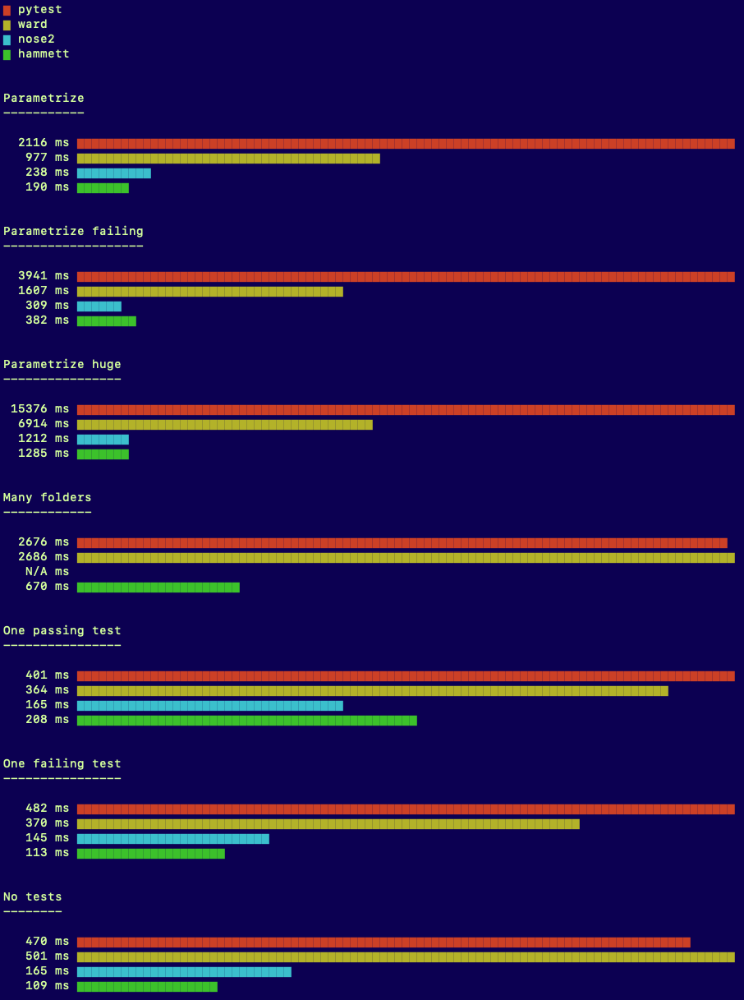

# Test runners benchmarks

A little project to benchmark test runners. Currently testing pytest, nose2 and hammett (one benchmark is unsupported in nose2 due to a lack of a necessary feature).

Current results (smaller is better):

